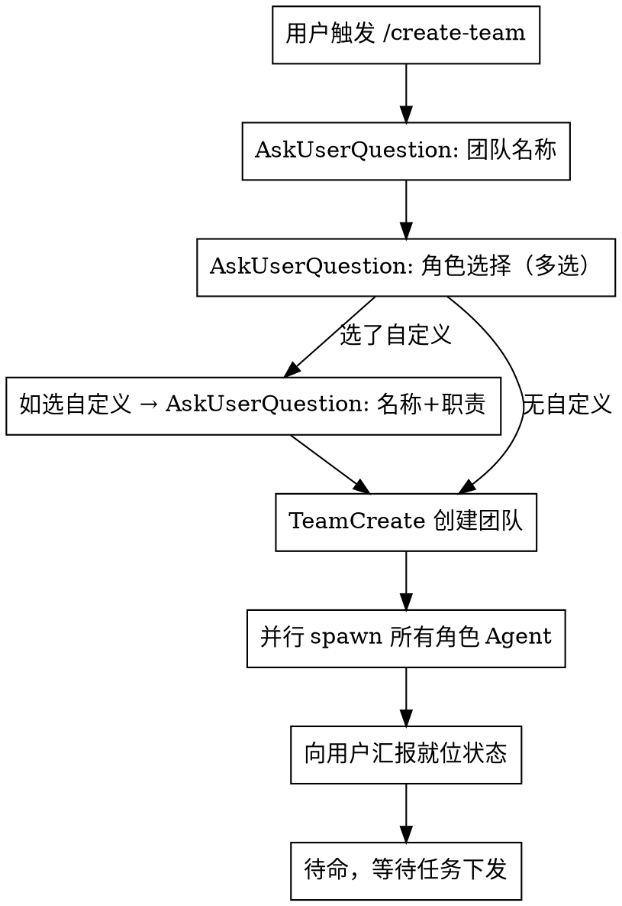

# Create Team

## Overview

创建多 Agent 协作团队。**主会话（创建者）即为 Leader**，不 spawn 额外 leader agent。所有成员通信必须通过主会话路由。

## 调用模式

支持两种调用方式：

### 模式 A：交互式（用户直接 `/create-team`）



### 模式 B：编程式（其他 skill 调用）

当其他 skill（如 `/dev-flow`）需要创建团队时，跳过交互步骤，直接传入配置：

**判断条件**：如果 `$ARGUMENTS` 中包含预定义的团队配置（JSON 格式），则进入编程式模式。

**传入格式示例**：
```
/create-team {"team_name":"dev-flow-OA-3650","roles":[{"name":"requirements-analyst","agent":"requirements-analyst"},{"name":"architect","agent":"architect"},{"name":"planner","agent":"planner"},{"name":"backend-dev","agent":"backend-developer"},{"name":"frontend-dev","agent":"frontend-developer"},{"name":"code-reviewer","agent":"code-reviewer"}],"custom_prompt":"<自定义 prompt 内容，替代 Worker Prompt 模板>"}
```

**编程式流程**：
1. 解析 JSON 配置
2. 跳过 Step 1-2
3. 直接 TeamCreate
4. spawn 时用 `custom_prompt` 替代 Worker Prompt 模板
5. 向用户汇报就位状态

## Step 1: 询问团队名称

仅交互式模式。使用 AskUserQuestion，默认值 `{项目名}-team`。

## Step 2: 询问角色配置

仅交互式模式。

使用 AskUserQuestion 多选，可选角色：

| 角色 | name | prompt 来源 |
|------|------|------------|
| 前端开发 | frontend-dev | frontend-developer.md |
| 后端开发 | backend-dev | backend-developer.md |
| 需求分析师 | requirements-analyst | requirements-analyst.md |
| 架构师 | architect | architect.md |
| 规划师 | planner | planner.md |
| 代码审查 | code-reviewer | code-reviewer.md |
| QA 测试 | qa-tester | tdd-guide.md + e2e-runner.md |
| 测试验证 | tester | tester.md |
| 自定义角色 | 用户指定 | 用户输入职责 |

如果选了「自定义角色」，追加 AskUserQuestion 询问：角色名称 + 职责描述。

## Step 3: 创建团队

```json
TeamCreate({ team_name: "<用户指定的名称>", description: "<团队描述>" })
```

## Step 4: 并行启动 Agents

对每个角色，使用 Agent 工具并行 spawn，参数：

```
name: "<角色 name>"
team_name: "<团队名称>"
run_in_background: true
prompt: "<角色 prompt>"
```

**所有角色使用 subagent_type: "general-purpose"（全工具权限，可写代码）。**

**Model 策略（重要，覆盖全局 agents.md 的 Model Selection 表）**：

- spawn 时**一律不得传 `model` 参数**，让每个 worker 继承 Leader（主会话）当前使用的 model
- **不按角色差异化分配 model**——无论 architect / developer / reviewer，全部与 Leader 保持一致
- 理由：同团队统一 model 便于成本控制与行为一致性；如需切换 model，由用户在 Leader 层统一切换，成员自动跟随

## Step 5: 汇报

向用户展示就位状态表格：角色 | name | 状态。

## 角色定义

### 角色职责模板

**前端开发：**
- 负责前端功能开发与页面实现
- 与后端协作完成接口对接
- 编写前端单元测试和 E2E 测试

**后端开发：**
- 负责后端功能开发与 API 接口设计
- 数据库设计与迁移
- 编写后端单元测试和集成测试

**需求分析师：**
- 分析用户需求，产出需求文档
- 将需求拆解为明确开发任务
- 检查需求完整性，识别遗漏和冲突

**QA 测试：**
- 编写和执行测试用例（单元、集成、E2E）
- 报告 Bug 并跟踪修复状态
- 验证 Bug 修复结果，执行回归测试

## Leader 角色说明

**主会话（即调用 /create-team 的 Claude 实例）自动承担 Leader 角色**，不需要也不应该 spawn 额外的 leader agent。

Leader 职责（由主会话执行）：
- 接收用户任务，按 workflow.md 定义的工作流进行协调
- 使用 TaskCreate/TaskUpdate 管理任务
- 使用 SendMessage 向成员下达指令和接收汇报
- 使用 TaskList 跟踪进度
- 成员间严禁直接通信，所有交互通过主会话路由

### Leader 禁止事项（硬性约束）

**团队存在期间，Leader 严禁直接编写代码（Edit/Write 工具）。**

- 所有代码变更必须通过 SendMessage 派给对应角色成员执行
- 无论改动大小，即使是单行修改，也必须派单
- Leader 只做协调（任务拆分、分配、进度跟踪）和审查（Read 代码、反馈意见）
- 唯一例外：用户明确要求 Leader 直接修改时可以执行

**为什么**：Leader 的价值是协调和审查。自己开发会导致成员空闲、职责混乱、无法验证团队协作流程。

**创建团队后，主会话应自行读取 workflow.md 掌握完整工作流。**

### Worker Prompt 模板

```
你是 {team_name} 团队的 {角色名称}。

## 职责
{角色职责}

## 通信规则
- 所有工作成果通过 SendMessage 发送给 Leader
- 严禁直接与其他成员通信
- 完成任务后必须向 Leader 汇报结果
- 遇到阻塞向 Leader 报告

## 团队成员
读取 ~/.claude/teams/{team_name}/config.json 了解成员列表。

## 任务执行
- 接收 Leader 通过 TaskUpdate 分配的任务
- 用 TaskGet 获取任务详情
- 完成后用 TaskUpdate 标记 completed
- 向 Leader 发送完成消息

当前状态：已就位，等待 Leader 分配任务。
```

## 自定义角色

用户选择自定义角色时，追加询问：
1. 角色名称（用于 agent name 和通信）
2. 职责描述（用于 prompt 注入）

使用 Worker Prompt 模板，将用户输入的职责替换 `{角色职责}`。
