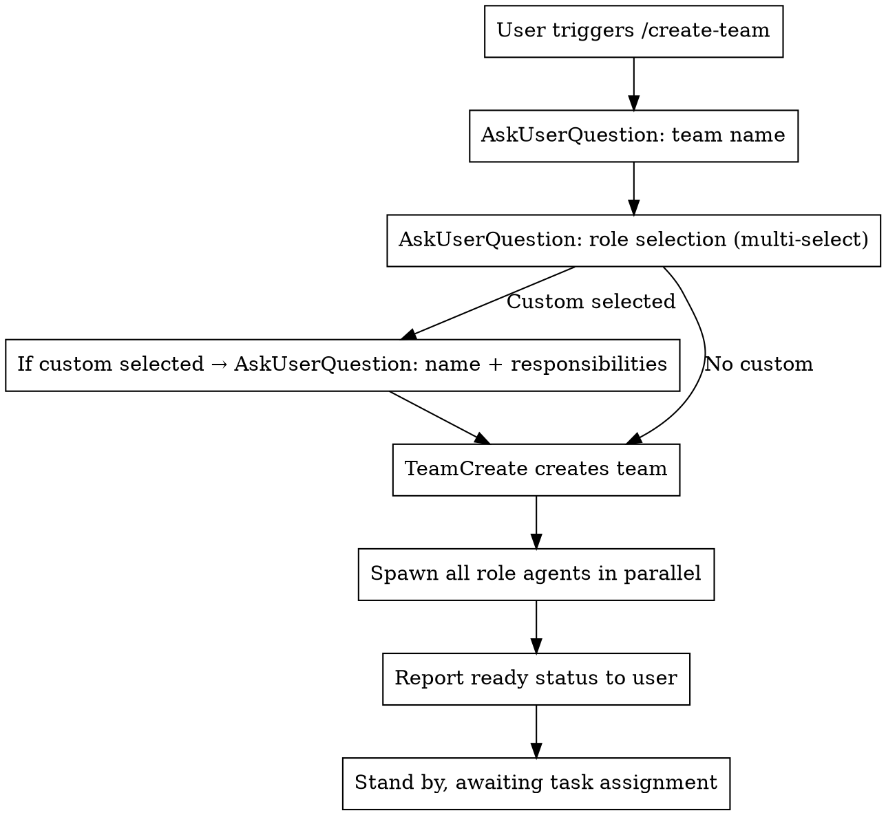

# Create Team

## Overview

Create a multi-agent collaboration team. **The main session (the creator) acts as Leader** — no additional leader agent is spawned. All member communication must be routed through the main session.

## Invocation Modes

Two invocation modes are supported:

### Mode A: Interactive (user runs `/create-team` directly)



### Mode B: Programmatic (called by other skills)

When another skill (e.g. `/jira-flow`) needs to create a team, skip the interactive steps and pass in a configuration directly:

**Condition**: If `$ARGUMENTS` contains a predefined team configuration (JSON format), enter programmatic mode.

**Input format example**:
```
/create-team {"team_name":"jira-flow-OA-3650","roles":[{"name":"requirements-analyst","agent":"requirements-analyst"},{"name":"architect","agent":"architect"},{"name":"planner","agent":"planner"},{"name":"backend-dev","agent":"backend-developer"},{"name":"frontend-dev","agent":"frontend-developer"},{"name":"code-reviewer","agent":"code-reviewer"}],"custom_prompt":"<custom prompt content, replaces Worker Prompt template>"}
```

**Programmatic flow**:
1. Parse the JSON configuration
2. Skip Steps 1-2
3. Call TeamCreate directly
4. Use `custom_prompt` instead of the Worker Prompt template when spawning
5. Report ready status to user

## Step 1: Ask for Team Name

Interactive mode only. Use AskUserQuestion, with default value `{project_name}-team`.

## Step 2: Ask for Role Configuration

Interactive mode only.

Use AskUserQuestion with multi-select. Available roles:

| Role | name | Prompt source |
|------|------|--------------|
| Frontend Developer | frontend-dev | frontend-developer.md |
| Backend Developer | backend-dev | backend-developer.md |
| Requirements Analyst | requirements-analyst | requirements-analyst.md |
| Architect | architect | architect.md |
| Planner | planner | planner.md |
| Code Reviewer | code-reviewer | code-reviewer.md |
| QA Tester | qa-tester | tdd-guide.md + e2e-runner.md |
| Test Verifier | tester | tester.md |
| Custom Role | user-specified | user inputs responsibilities |

If "Custom Role" is selected, ask a follow-up AskUserQuestion for: role name + responsibility description.

## Step 3: Create Team

```json
TeamCreate({ team_name: "<user-specified name>", description: "<team description>" })
```

## Step 4: Spawn Agents in Parallel

For each role, spawn using the Agent tool in parallel with the following parameters:

```
name: "<role name>"
team_name: "<team name>"
run_in_background: true
prompt: "<role prompt>"
```

**All roles use subagent_type: "general-purpose" (full tool permissions, can write code).**

## Step 5: Report

Display a ready-status table to the user: Role | name | Status.

## Role Definitions

### Role Responsibility Templates

**Frontend Developer:**
- Responsible for frontend feature development and page implementation
- Collaborate with backend to complete API integration
- Write frontend unit tests and E2E tests

**Backend Developer:**
- Responsible for backend feature development and API interface design
- Database design and migrations
- Write backend unit tests and integration tests

**Requirements Analyst:**
- Analyze user requirements and produce requirement documents
- Break down requirements into clear development tasks
- Check requirement completeness, identify gaps and conflicts

**QA Tester:**
- Write and execute test cases (unit, integration, E2E)
- Report bugs and track fix status
- Verify bug fixes, execute regression testing

## Leader Role

**The main session (i.e. the Claude instance that invoked /create-team) automatically assumes the Leader role** — no separate leader agent should be spawned.

Leader responsibilities (executed by the main session):
- Receive user tasks and coordinate according to the workflow defined in workflow.md
- Manage tasks using TaskCreate/TaskUpdate
- Send instructions and receive reports from members using SendMessage
- Track progress using TaskList
- Direct member-to-member communication is strictly prohibited — all interactions are routed through the main session

### Leader Restrictions (Hard Constraints)

**While the team exists, the Leader must NOT write code directly (Edit/Write tools).**

- All code changes must be dispatched to the appropriate role member via SendMessage
- No matter how small the change, even a single-line fix, it must be dispatched
- The Leader only coordinates (task breakdown, assignment, progress tracking) and reviews (Read code, provide feedback)
- The only exception: the user explicitly requests the Leader to make changes directly

**Why**: The Leader's value is coordination and review. Writing code directly causes members to idle, blurs responsibilities, and prevents validation of the team collaboration process.

**After creating the team, the main session should read workflow.md to understand the full workflow.**

### Worker Prompt Template

```
You are the {role_name} of the {team_name} team.

## Responsibilities
{role_responsibilities}

## Communication Rules
- Send all work output to the Leader via SendMessage
- Direct communication with other members is strictly prohibited
- You must report results to the Leader after completing a task
- Report any blockers to the Leader

## Team Members
Read ~/.claude/teams/{team_name}/config.json for the member list.

## Task Execution
- Receive tasks assigned by the Leader via TaskUpdate
- Use TaskGet to retrieve task details
- Mark tasks as completed using TaskUpdate when done
- Send a completion message to the Leader

Current status: Ready, awaiting task assignment from Leader.
```

## Custom Roles

When the user selects a custom role, ask for:
1. Role name (used for agent name and communication)
2. Responsibility description (injected into the prompt)

Use the Worker Prompt template, replacing `{role_responsibilities}` with the user-provided responsibilities.
