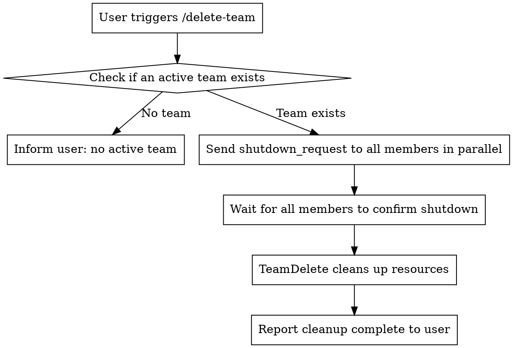

# Delete Team

## Overview

Gracefully shut down the team: notify all members to stop → confirm all shutdowns → clean up team resources.

## Flow



## Steps

### 1. Check for Team

Read the `~/.claude/teams/` directory to confirm an active team exists. If no team is found, inform the user and exit.

### 2. Parallel Shutdown

Send a shutdown_request to each member using SendMessage:

```json
SendMessage({
  to: "<member name>",
  message: { "type": "shutdown_request", "reason": "Team tasks complete, cleaning up" }
})
```

Send to all members in parallel.

### 3. Wait for Confirmation

Wait for all members to respond with `shutdown_response` and `approve: true`.

If any member refuses or times out (30 seconds), report to the user and ask how to proceed.

### 4. Clean Up Resources

Once all shutdowns are confirmed, execute `TeamDelete` to clean up the team directory and task list.

### 5. Report

Confirm to the user that the team has been fully cleaned up.
