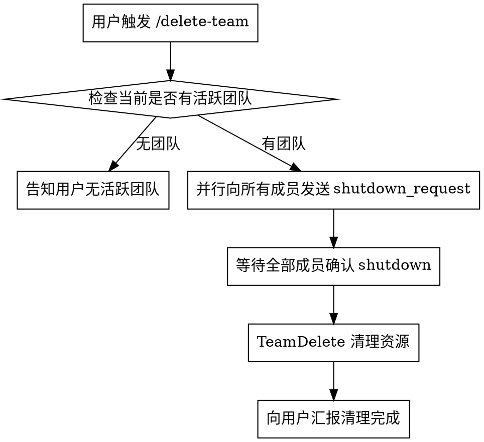

# Delete Team

## Overview

优雅关闭团队：通知所有成员停止 → 确认全部 shutdown → 清理团队资源。

## Flow



## Steps

### 1. 检查团队

读取 `~/.claude/teams/` 目录，确认当前活跃团队。如果无团队，告知用户并结束。

### 2. 并行 Shutdown

对每个成员使用 SendMessage 发送 shutdown_request：

```json
SendMessage({
  to: "<成员 name>",
  message: { "type": "shutdown_request", "reason": "团队任务结束，正在清理" }
})
```

所有成员并行发送。

### 3. 等待确认

等待所有成员回复 `shutdown_response` 并 `approve: true`。

如有成员拒绝或超时（30 秒），向用户报告并询问如何处理。

### 4. 清理资源

确认全部 shutdown 后，执行 `TeamDelete` 清理团队目录和任务列表。

### 5. 汇报

向用户确认团队已完全清理。
